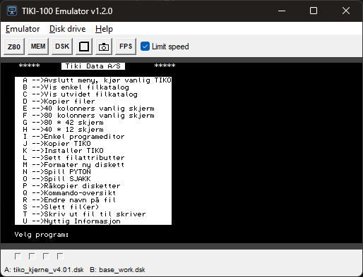
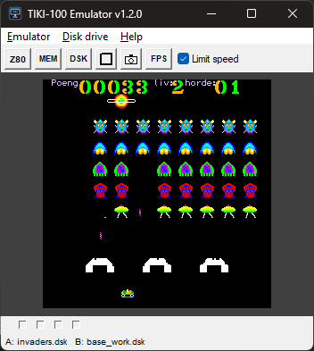
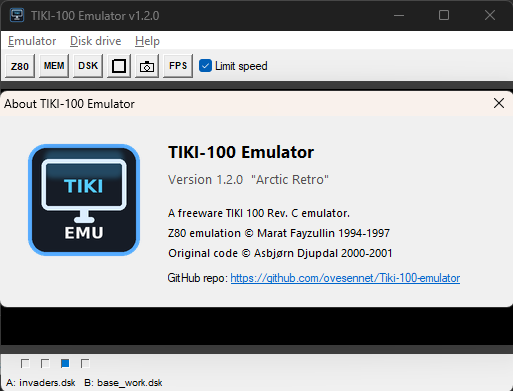

# TIKI-100 Emulator

A freeware emulator for the **TIKI 100 Rev. C** computer, originally developed by Asbjørn Djupdal (2000-2001). The TIKI 100 was a Norwegian Z80-based microcomputer produced in the 1980s, running a CP/M clone, (KP/M - later TIKO) and TIKI-BASIC.

> **Note:** This emulator is **Windows only**. It uses the native Win32 API for display, input, and serial/parallel port access.

## Screenshots





The emulator includes:
- Z80 CPU emulation (based on Marat Fayzullin's Z80 engine)
- Video emulation (1024×256 high-res, 512×256 medium-res, 256×256 low-res modes)
- Floppy disk controller (WD1793) emulation with support for various disk image formats
- Z80-CTC (Counter/Timer) emulation
- Z80-DART (serial port) emulation
- Keyboard emulation with Norwegian layout support
- Sound chip emulation (AY-3-8912 PSG — 3 tone channels, noise, envelopes)

## Prerequisites to build from the C source

You need **MSYS2** with the **MinGW64** toolchain installed on Windows.

### 1. Install MSYS2

Download and install MSYS2 from [https://www.msys2.org](https://www.msys2.org). Follow the installer defaults.

### 2. Install build tools

Open the **MSYS2 MINGW64** terminal (not the MSYS2 MSYS terminal) and run:

```bash
pacman -Syu
pacman -S mingw-w64-x86_64-gcc make
```

This installs:
- `gcc` — the C compiler (MinGW 64-bit)
- `make` — GNU Make
- `windres` — Windows resource compiler (included with the gcc package)

### 3. Verify installation

```bash
gcc --version
make --version
windres --version
```

## Building

Open the **MSYS2 MINGW64** terminal and navigate to the `src` directory:

```bash
cd /c/code/Tiki-100-emulator/src
make
```

The build output (object files and `tikiemul.exe`) is placed in the `bin/` directory at the project root.

To clean build artifacts:

```bash
make clean
```

## Running

Copy `tiki.rom` from the `src/` directory into the `bin/` directory, then run:

```bash
./bin/tikiemul.exe
```

The emulator looks for `tiki.rom` in the current working directory. Disk images (`.dsk` files) can be loaded from the **Disk drive** menu.

### Command-line options

```bash
./bin/tikiemul.exe [-diska <path>] [-diskb <path>] [-console]
```

| Option | Description |
|--------|-------------|
| `-diska <path>` | Load a disk image into drive A: at startup |
| `-diskb <path>` | Load a disk image into drive B: at startup |
| `-console` | Enable debug logging to stderr and `tikiemul.log` |

## Changes from original v1.1.1

### v1.2.0 (Arctic Retro)

**New features:**
- **AY-3-8912 sound chip emulation**: Full PSG audio with 3 tone channels, noise generator, envelope generator, and register write masking — output via waveOut API at 44100 Hz
- **Toolbar**: Button row above the emulator screen area with quick-access tools
- **Fullscreen mode**: Integer-scaled fullscreen with black bars, toggle via F12 or toolbar
- **Screenshot to clipboard**: Copies the emulator screen to the clipboard (F11)
- **FPS overlay**: Real-time frame rate counter drawn on the display (F10)
- **Z80 information window**: Live-updating CPU register, flags, and interrupt state viewer (toolbar button)
- **Memory viewer/editor**: Hex/ASCII memory viewer with search, direct editing, and address navigation (toolbar button)
- **Disk directory viewer**: CP/M directory listing for loaded disk images, with file sizes and disk usage summary (toolbar button)
- **CPU halt/continue**: Pause and resume Z80 execution from the memory viewer toolbar
- **Command-line disk loading**: Load disk images at startup with `-diska <path>` and `-diskb <path>`
- **Debug logging**: Optional `-console` flag enables logging to stderr and `tikiemul.log`
- **Help menu**: Keyboard shortcuts reference dialog
- **Disk filename status bar**: New row at the bottom of the window showing `A: filename.dsk  B: filename.dsk` (or "not loaded") for each drive
- **Minimum window size**: Low-res (40-column) mode enforces a 350px minimum width; the emulator area is centered with dark gray margins on all sides
- **Custom About dialog**: Shows the application icon (128×128), version string, credits, and a clickable GitHub repository link
- **EXE version information**: File properties now show version, description, and copyright via embedded VERSIONINFO resource
- **Centralized version constant**: Single `version.h` header defines `VERSION_STR`, `VERSION_MAJOR/MINOR/PATCH` — used by the window title, About dialog, log messages, and EXE resource

**FDC emulation fixes (200KB disk support):**
- **Side select via port 0x1C bit 4**: The system register side select signal was previously ignored by the FDC emulation; READ_ADDR and WRITE_TRACK now use it
- **READ_ADDR Record Not Found for non-existent sides**: Single-sided disks now correctly return RNF (status 0x10) when the BIOS probes side 1, enabling proper format detection
- **Mixed-density boot track simulation**: READ_ADDR reports 128-byte sectors on tracks 0–1 for single-sided DD disks, matching real TIKI-100 200KB media which used single-density boot tracks
- **DPB patching for 200KB disks**: The correct CP/M Disk Parameter Block (SPT=40, BSH=3, OFF=2) is written into Z80 RAM when a 200KB disk is first accessed, since the TIKO BIOS format detection doesn't always update the DPB
- **Type III command mask fix**: READ_ADDR, READ_TRACK, and WRITE_TRACK command masks changed from `0xF8` to `0xF0` to handle all valid WD FD17xx command variants (including head-load flag)

**Other code fixes:**
- Fixed `boolean` type conflict with Windows headers (renamed to `tiki_bool`)
- Fixed Norwegian keyboard input (øæå) — corrected key table alignment and VK code mapping
- Fixed Norwegian characters in source files (converted to UTF-8 with hex escapes)
- Fixed toolbar scroll bug — emulator content no longer bleeds into the toolbar area
- Fixed keyboard input in fast mode — keys are reliably registered at high emulation speed
- Fixed uninitialized `msg.wParam` return value in `WinMain`
- Compiler warnings suppressed for third-party Z80 code

**UI modernization:**
- **Visual styles manifest**: Embedded application manifest enables Windows Common Controls v6 (modern button/dialog rendering)
- **DPI awareness**: Per-Monitor V2 DPI awareness declared in manifest for crisp rendering on high-DPI displays
- **Dark title bar**: Uses `DwmSetWindowAttribute` for immersive dark mode title bar on Windows 10/11
- **Drag-and-drop disk loading**: Drop `.dsk` files onto the window to load into drive A: (hold Shift for drive B:)
- **Most Recently Used (MRU) disk list**: Last 8 loaded disk images appear in the Disk drive menu for quick access; persisted to `tikiemul.ini`
- **Resizable window with integer scaling**: Window is freely resizable; the emulator display scales to the largest integer multiple that fits, centered with dark gray margins
- **Window position persistence**: Window position is saved to `tikiemul.ini` on exit and restored on next launch (validated to ensure it's on-screen)

**Build/platform changes:**
- Renamed all user-visible strings from "TIKI-100_emul" to "TIKI-100 Emulator"
- Updated to v1.2.0, about dialog shows "v1.2.0 by Arctic Retro"
- Simplified Makefile for Windows/MinGW only (removed Amiga and Unix targets); output to `bin/` directory
- Amiga support removed (amiga.c, amiga.cd, amiga_icons/, amiga_translations/)
- Win32 string literals compiled with `-fexec-charset=CP1252` for correct Norwegian character display

## Supported disk image formats

| Tracks | Sides | Sectors | Sector size | Total size |
|--------|-------|---------|-------------|------------|
| 40     | 1     | 18      | 128 bytes   | 90 KB      |
| 40     | 1     | 10      | 512 bytes   | 200 KB     |
| 40     | 2     | 10      | 512 bytes   | 400 KB     |
| 80     | 2     | 10      | 512 bytes   | 800 KB     |

## License

Freeware. Z80 emulation copyright © Marat Fayzullin 1994-1997. Remainder copyright © Asbjørn Djupdal 2000-2001.

## Links

- **GitHub**: [https://github.com/ovesennet/Tiki-100-emulator](https://github.com/ovesennet/Tiki-100-emulator)
